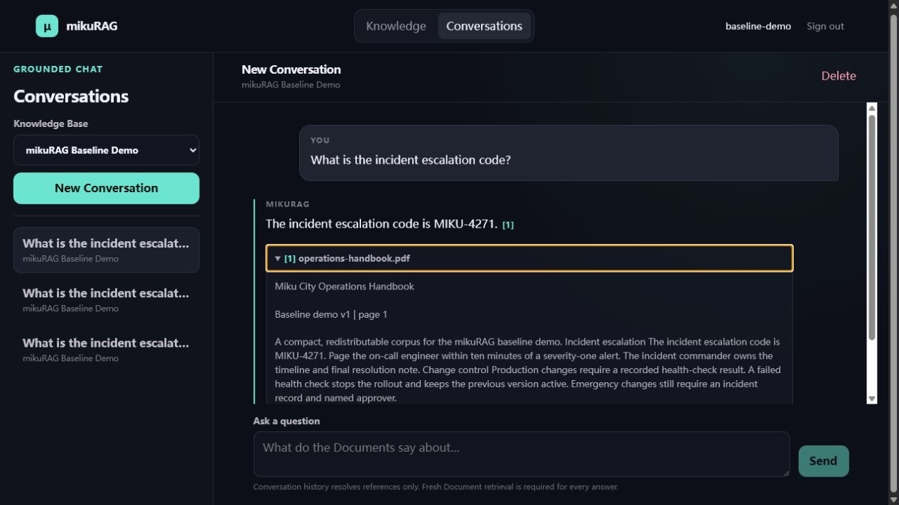
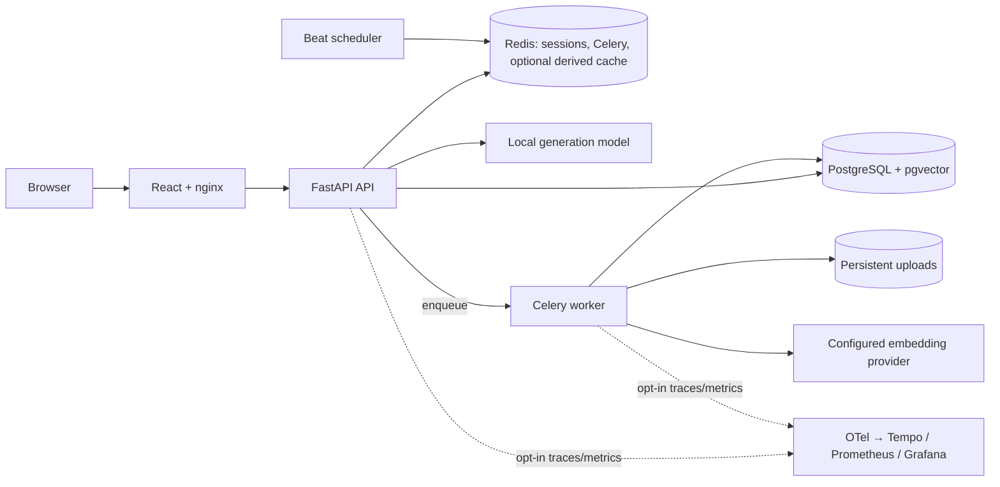
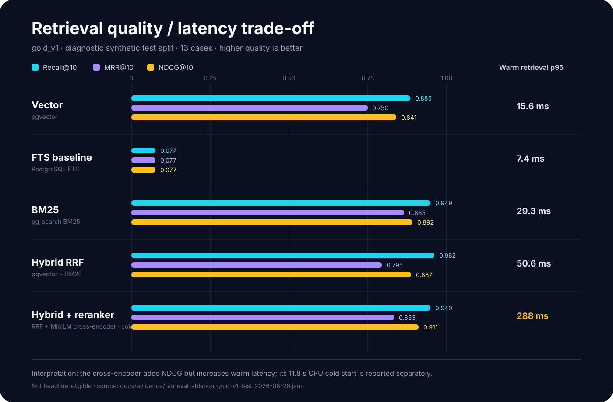

# mikuRAG

[](https://github.com/Manticore0918/mikuRAG/actions/workflows/ci.yml)
[](https://github.com/Manticore0918/mikuRAG/actions/workflows/release.yml)

mikuRAG turns a team’s mixed private documents into grounded answers whose
claims can be inspected against source-specific Citations. It is a self-hosted,
multi-user FastAPI/React system with durable background Ingestion, PostgreSQL as
the authority, hybrid retrieval, validated local-model output, and explicit
privacy and failure boundaries.

The current public tag is `v0.1.0`. The repository is preparing `v1.0`; the
[release-readiness checklist](./docs/PORTFOLIO-RELEASE.md) records the remaining
evidence and deliberately prevents a premature portfolio release.



## Why this project exists

Many RAG demos stop at “retrieve text and ask a model.” mikuRAG focuses on the
engineering work needed after that demo:

- asynchronous, resumable, observable ingestion of heterogeneous sources;
- tenant and Ready-state predicates applied before retrieval limits;
- lexical and semantic retrieval that can be measured independently;
- server-owned Citations and fail-closed answer validation;
- deletion/re-index cache invalidation without making Redis authoritative; and
- reproducible evaluation, CI, migrations, release artifacts, and privacy-safe
  telemetry.

## Architecture



PostgreSQL owns Users, access grants, Document lifecycle, chunks, vectors,
Conversations, Citations, measurements, and Knowledge Base index generations.
Redis contains only replaceable coordination/cache data. The stable retrieval
default is pgvector plus PostgreSQL full-text search fused with RRF; pg_search
BM25, query planning, the local cross-encoder, hierarchical retrieval, and
derived caches are explicit experimental/optional paths.

## Five-minute seeded demo

The interaction path takes about five minutes after first-time image pulls,
dependency installs, and the local generation model are ready.

Prerequisites: Docker Compose, Python 3.12, Node 20+, an external
OpenAI-compatible Ollama endpoint, and a configured embedding-provider key. Copy
`.env.example` to `.env`, replace every placeholder, and use the exact model tag
served by Ollama.

```powershell
Copy-Item .env.example .env
# Edit .env, including MIKURAG_EMBEDDING_API_KEY and generation endpoint/model.
.\scripts\mikurag.ps1 setup

$env:MIKURAG_DEMO_ADMIN_PASSWORD = "replace-with-a-demo-admin-password"
$env:MIKURAG_DEMO_USER_PASSWORD = "replace-with-a-demo-user-password"
.\scripts\mikurag.ps1 seed
.\scripts\mikurag.ps1 smoke
```

Open `http://localhost:5173`, sign in as the seeded demo User, and ask the
versioned PDF, Markdown, HTML, Python, and TypeScript questions. The seed is
idempotent and waits for the real worker to publish all Documents as `Ready`.
If Windows reserves port 5173, set `MIKURAG_FRONTEND_PORT` to a free host port
before starting Compose and open that port instead.

POSIX shells provide the same workflow:

```sh
cp .env.example .env
sh ./scripts/mikurag.sh setup
export MIKURAG_DEMO_ADMIN_PASSWORD='replace-with-a-demo-admin-password'
export MIKURAG_DEMO_USER_PASSWORD='replace-with-a-demo-user-password'
sh ./scripts/mikurag.sh seed
sh ./scripts/mikurag.sh smoke
```

The [baseline demo guide](./docs/BASELINE-DEMO.md) lists the questions, expected
evidence, authorization check, restart-durability check, and cleanup procedure.

## Sources and Citation behavior

Uploads are resumable in sequential 5 MiB parts. The server independently
verifies size, SHA-256, and format before creating a Document; the worker then
extracts, normalizes, chunks, embeds, and atomically publishes it as `Ready`.
Files are limited to 50 MB and PDFs to 500 pages.

| Source | Extracted structure | Citation locator shown to the User |
| --- | --- | --- |
| PDF | page-aware layout blocks | page or page range |
| DOCX | paragraphs and tables | paragraph/table locator when available |
| TXT | UTF-8 text blocks | source line range |
| Markdown | heading hierarchy, lists, tables, fenced code | heading path and source lines |
| HTML | title, headings, semantic elements, text offsets | heading, element, lines, and safe source URI |
| Python | AST-discovered module, class, and function symbols | repository-relative path, line range, symbol |
| JavaScript / TypeScript | top-level declarations with line-aware fallback | repository-relative path, line range, symbol |

Citations are created after the model response is fully buffered and validated.
The model may refer only to supplied Evidence IDs; the server creates markers,
persists retained excerpts, and exposes original source bytes only after a fresh
authorization check. Unknown evidence, missing/conflicting support, or invalid
structured output returns an explicit inability to answer reliably.

## Measured retrieval diagnostics

The executable harness ingests a redistributable synthetic corpus through the
real worker, queries the production retrieval path, writes raw and aggregate
reports, and deletes its isolated Knowledge Base. The current corpus contains 64
reviewed questions over 14 Documents; the frozen test slice contains 13 cases.

| Mode | Recall@10 | MRR@10 | NDCG@10 | Retrieval p95 | Mean evidence tokens |
| --- | ---: | ---: | ---: | ---: | ---: |
| Vector | 0.8846 | 0.7500 | 0.8408 | 15.6 ms | 290 |
| PostgreSQL FTS baseline | 0.0769 | 0.0769 | 0.0769 | 7.4 ms | 0 |
| pg_search BM25 | 0.9487 | 0.8654 | 0.8922 | 29.3 ms | 272 |
| Vector + BM25 + RRF | 0.9615 | 0.7949 | 0.8871 | 50.6 ms | 300 |
| Hybrid + local cross-encoder | 0.9487 | 0.8333 | 0.9107 | 4,914.3 ms | 267 |



These are diagnostics, not general benchmark claims: `gold_v1` is small,
synthetic, self-authored, and explicitly marked `headline_eligible: false`. The
[committed evidence envelope](./docs/evidence/retrieval-ablation-gold-v1-test-2026-08-28.json)
records the exact commit, manifest blob, command, configuration, run IDs, and
full-precision values. The [analysis](./docs/EVALUATION-CHECKPOINT-3.md) explains
confidence intervals and category results.

The evidence drove conservative defaults. BM25 improved aggregate diagnostics
but did not prove the expected exact-identifier advantage. The cross-encoder
improved hybrid NDCG by 0.0236 while exceeding the 1,500 ms p95 target by more
than three times, so both BM25 promotion and learned reranking remain off by
default. Reranker failure is visible and falls back to the already-authorized RRF
order.

Run a small evaluation with:

```powershell
docker compose --profile tools run --rm evaluate `
  python -m app.evaluation_cli run --max-cases 3
```

See the [evaluation runner contract](./docs/EVALUATION-RUNNER.md) for complete
commands, schemas, cleanup behavior, comparisons, and ablations. A separate
[synthetic capacity smoke artifact](./docs/evidence/capacity-smoke-2026-08-30.json)
proves the benchmark schema but is not a production-capacity claim.

## Reliability, security, and privacy boundaries

- Passwords use Argon2id. Signed HTTP-only same-site sessions are rechecked
  against current User state; password reset, role change, or disabling a User
  invalidates existing sessions.
- Browser mutations require a matching CSRF cookie/header. Login failures are
  throttled without disclosing whether a username exists.
- A Conversation is permanently scoped to one Knowledge Base. Unauthorized
  Knowledge Bases return `404`, and authorization, `Ready` state, embedding
  model, and metadata filters are SQL predicates before candidate limits.
- Ingestion state is durable in PostgreSQL. Retrieval excludes a Document as
  soon as deletion begins; publication and deletion advance an authoritative
  index generation that makes stale Redis entries unreachable.
- Redis errors, BM25 absence, reranker failure, query-rewrite failure, and
  unavailable optional telemetry degrade to documented stable paths. Final
  answers are never cached by default.
- Every response has an `X-Request-ID`; it propagates to worker tasks and redacted
  observations. Opt-in telemetry carries identifiers, counts, durations, and
  statuses—not query, answer, Evidence, or Document text.
- Release CI runs Ruff/pytest, frontend tests/lint/build, clean and previous-head
  migrations, real PostgreSQL/Redis integration tests, image builds, Compose
  smoke, and a schema-validated evaluation subset. Tagged releases are designed
  to publish immutable images, SBOMs, checksums, evaluation evidence, and rollback
  guidance.

The 2026-08-30 [local release-candidate smoke record](./docs/evidence/release-candidate-smoke-2026-08-30.json)
captures the migration, multi-format retrieval, hard-worker-kill recovery,
isolated Compose, evaluation-schema, and complete telemetry-pipeline proofs. It
is explicitly marked as dirty-worktree functional evidence, not a clean-clone
benchmark.

## Known limitations and tradeoffs

- Extracted chunks leave the Installation for the configured Alibaba embedding
  endpoint. Self-hosting the control plane does not remove this external data
  boundary. Provider retention and regional processing must be reviewed by the
  operator.
- Ollama is external to Compose. Generation quality, latency, hardware needs, and
  model licensing depend on the operator’s chosen local model.
- OCR is out of scope. Scanned/image-only PDFs fail with a bounded error; PDFs are
  text-extraction only.
- JavaScript/TypeScript extraction intentionally covers top-level declarations,
  not a full compiler/type graph. Malformed sources use a line-aware fallback.
- `gold_v1` is not externally representative. Answer-faithfulness calibration,
  a provider-backed cold/warm report, and a real trace waterfall remain release
  gates; no complete API-cost or answer-quality headline is published yet.
- Hierarchical chunking, summary generation, rollout jobs, query planning,
  pg_search BM25 promotion, the cross-encoder, and derived caches are feature-off
  or non-default until their frozen evaluation and operational gates pass.
- Derived caching and the observability profile are optional. Redis remains
  required for Celery coordination and login throttling; PostgreSQL, the upload
  volume, the worker, and working model providers are required for the full
  application.

## Engineering decisions

| Decision | Rationale |
| --- | --- |
| [PostgreSQL + pgvector](./docs/adr/0002-postgresql-and-pgvector.md) | One authority for access, lifecycle, provenance, and vector retrieval |
| [pg_search BM25 with FTS fallback](./docs/adr/0005-pg-search-bm25.md) | Real lexical scoring without making an optional extension a hard dependency |
| [Generation-versioned Redis caches](./docs/adr/0006-redis-derived-cache-invalidation.md) | Immediate logical invalidation without cache-key scans |
| [Privacy-safe optional telemetry](./docs/adr/0007-optional-opentelemetry-telemetry.md) | Operability without private content or a larger default stack |
| [Version-complete experiment identity](./docs/adr/0008-version-complete-experiment-identity.md) | Prevent comparisons across silently different corpora/configurations |
| [Fused-order reranker fallback](./docs/adr/0009-reranker-falls-back-to-fused-order.md) | Preserve retrieval availability and make degraded experiments visible |
| [Deterministic reviewed evaluator](./docs/adr/0010-deterministic-evaluation-judge.md) | Auditable faithfulness baseline before any LLM judge |

## Development checks

```powershell
.\scripts\mikurag.ps1 checks
.\scripts\mikurag.ps1 migrations
.\scripts\mikurag.ps1 compose-smoke
```

Equivalent direct commands are documented in the scripts and CI workflows. The
provider-backed full evaluation is intentionally separate from fast pull-request
checks.

## Project evidence and operations

- [Portfolio release readiness](./docs/PORTFOLIO-RELEASE.md)
- [Portfolio media and redaction plan](./docs/PORTFOLIO-MEDIA.md)
- [Truthful résumé bullets](./docs/RESUME-BULLETS.md)
- [Versioned evidence index](./docs/evidence/README.md)
- [Baseline demo](./docs/BASELINE-DEMO.md)
- [Evaluation runner](./docs/EVALUATION-RUNNER.md)
- [Observability, SLOs, and drills](./docs/OBSERVABILITY.md)
- [Chunking configuration and rollout](./docs/CHUNKING-CONFIG.md)
- [Architecture decisions](./docs/adr)
- [Product language](./CONTEXT.md)
