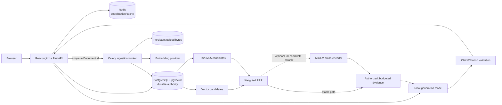

# Architecture and metrics case study

## The system in one page

mikuRAG is a self-hosted, multi-user retrieval-augmented generation system for
private team documents. Its design separates durable truth from replaceable
coordination: PostgreSQL owns authorization, Document lifecycle, chunks,
vectors, Citations, measurements, and index generations; Redis carries Celery
jobs, sessions, throttling, and optional derived cache entries. This boundary
lets the question path degrade safely and lets interrupted ingestion resume
without treating queue delivery as exactly once.

The retrieval SQL applies Knowledge Base authorization, `Ready` status,
embedding-model identity, and metadata filters before candidate limits. Vector
and lexical rankings are fused with reciprocal-rank fusion (RRF). Generation
receives only the selected Evidence, and answer text is released only after the
server validates every claim and Citation reference.

## Measured retrieval trade-off

The frozen `gold_v1` test slice contains 13 reviewed queries over a small,
synthetic 14-Document corpus. These are diagnostic results, not general
benchmark claims.

| Mode | Recall@10 | MRR@10 | NDCG@10 | Steady-state retrieval p95 |
| --- | ---: | ---: | ---: | ---: |
| Vector | 0.8846 | 0.7500 | 0.8408 | 15.6 ms |
| PostgreSQL FTS | 0.0769 | 0.0769 | 0.0769 | 7.4 ms |
| pg_search BM25 | 0.9487 | 0.8654 | 0.8922 | 29.3 ms |
| Vector + BM25 + RRF | **0.9615** | 0.7949 | 0.8871 | 50.6 ms |
| RRF + MiniLM cross-encoder | 0.9487 | 0.8333 | **0.9107** | 287.8 ms |

The learned reranker improved MRR by 0.0385 and NDCG by 0.0236 over RRF, but
reduced recall by 0.0128 and made warm p95 5.7 times slower. RRF therefore
remains the stable path; the learned reranker is an explicit experiment with a
timeout, concurrency bound, and observable fallback to the already-authorized
fused order. Full-precision results and methodology are preserved in the
[evidence envelope](./evidence/retrieval-ablation-gold-v1-test-2026-08-28.json).

## Short postmortem: the 4.9-second p95

**What happened.** The original evaluation lazy-loaded the cross-encoder during
the first timed retrieval. That case took 11,836.3 ms, including 11,799.6 ms in
reranker startup. With only 13 cases, percentile interpolation between the
roughly 300 ms warm tail and that single cold observation produced a misleading
4,914.3 ms p95.

**Impact.** The chart correctly exposed a serious cold-start cost, but it mixed
two operational questions: first-use readiness and steady-state query latency.
It overstated normal reranked retrieval while obscuring the separate 11.8-second
startup risk.

**Correction.** Evaluation now loads the model and performs one inference before
timed cases, records warmup status and duration in run configuration, and reports
the remaining 12 cases' 182.4 ms median / 287.8 ms p95. The original
cold-inclusive p95 and cold case remain in the evidence for auditability. The
product decision did not flip: on this small corpus, the quality gain does not
justify the warm latency, CPU cost, and cold-start exposure by default.

## Durable worker recovery

Ingestion assumes workers can disappear at any stage. A worker atomically claims
only a `Pending`, `Failed`, or stale `Processing` Document in PostgreSQL, moves
it to `Processing`, increments its attempt counter, and persists stage/progress.
Extraction, normalization, chunk construction, validation, and embedding happen
before publication. The final transaction locks the Document, replaces chunks,
marks it `Ready`, and increments the Knowledge Base index generation. A crash
before commit cannot publish partial chunks; a later delivery can reclaim the
stale row and safely repeat the work.

The 2026-08-30 local restart smoke hard-killed the worker and passed worker
restart, stale-claim recovery, eventual `Ready` state, failed-parser retry, and
the assertion that a failed attempt left zero partial chunks. The Redis
visibility timeout was also exercised, but PostgreSQL remained the correctness
boundary. This is functional local-worktree evidence—not a clean-clone release
benchmark—and is recorded in the
[release-candidate smoke artifact](./evidence/release-candidate-smoke-2026-08-30.json).

**Result:** optional ranking can fail without taking retrieval down, and worker
loss can delay ingestion without corrupting the searchable index. The remaining
release gates are provider-backed cold/warm measurements on representative
hardware and a clean-clone recovery run at the release commit.
